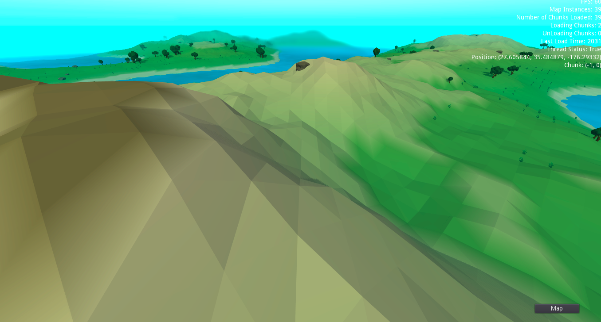
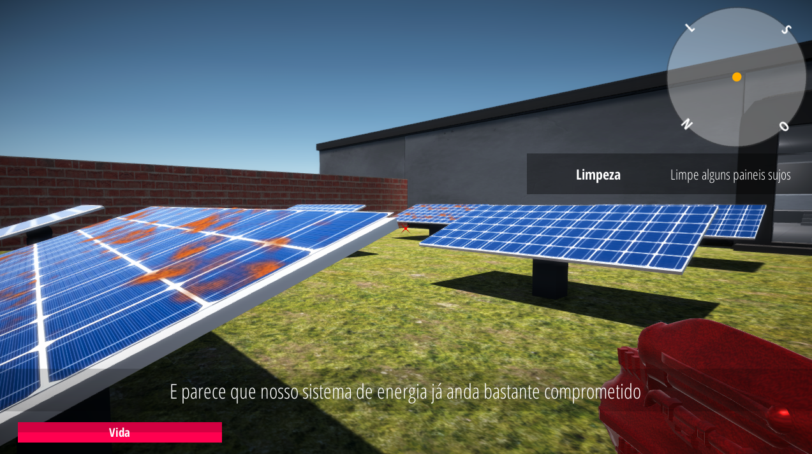

<!-- 
_class: lead
-->

# Aula 00: Introdução à Disciplina

---

<!--
paginate: true 
class: normal
-->

## Apresentação do Professor
### Ramon Venson

* Bacharel em Ciência da Computação
* Especialização em Tecnologias Web
* Mestrado em Tecnologia da Informação e Comunicação
* Professor e Desenvolvedor

---

### Interesses

* Desenvolvimento Web
* Desenvolvimento de Jogos
* Software Livre

---

## Apresentação da Disciplina
### Ementa

Conceitos sobre aplicações WEB; Programação orientada a objetos; Arquitetura multicamadas; Introdução a Servidores de aplicação; HTTP, Requisições e Principais Protocolos; Aspectos básicos de segurança e escalabilidade; Linguagens e frameworks back-end; Persistência de dados; Construção e implementação de APIs; Estudo e implementação de novas tecnologias de WEB; Modelagem de soluções dinâmicas.

---

### Objetivo Geral

Identificar e qualificar a utilização de tecnologias e arquiteturas para desenvolvimento de serviços web

---

### Objetivos Específicos

* Caracterizar a estrutura e funcionamento de servidores web e seus protocolos;
* Identificar tecnologias utilizadas na construção de serviços web;
* Demonstrar a utilização de tecnologias usadas na transferência e armazenamento de dados;
* Desenvolver a autonomia na escolha e utilização de diferentes tecnologias web.

---

### Conteúdo Programático

* Arquitetura Web
* Revisão de Programação
* Controle de Versão
* Spring Framework
* Arquitetura REST
* Integração com Banco de Dados
* Implantação de Software

---

### Avaliações

* **N1**: Exercícios da Disciplina (`finalizados / total * 10.0`)
* **N2**: Projeto Intermediário
* **N3**: Projeto Final
* **N-1**: Avaliação Escrita

#### Média Final

`(N1 + N2 + N3) / 3`

> A avaliação `N-1` possui caráter substitutivo em relação à avaliação de menor desempenho (incluindo ela mesma).

---

### Recursos

* Aulas expositivas;
* Práticas em sala de aula;
* Exercícios práticos semanais;
* Solução dos principais exercícios passo-a-passo;

---

### Contatos

* Email: ramon.venson@satc.edu.br
* Ambiente Virtual
* Discord

---

### Outras considerações

* Não deixar de realizar as atividades
* Informe o professor prontamente sobre qualquer problema