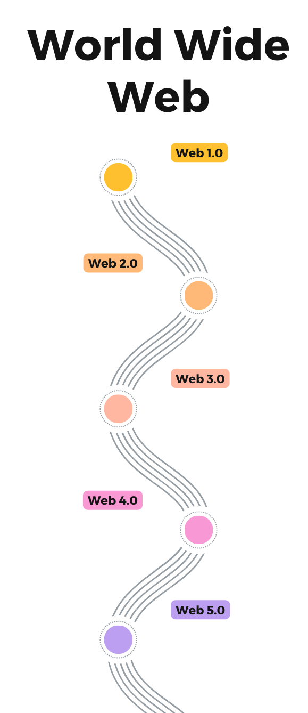
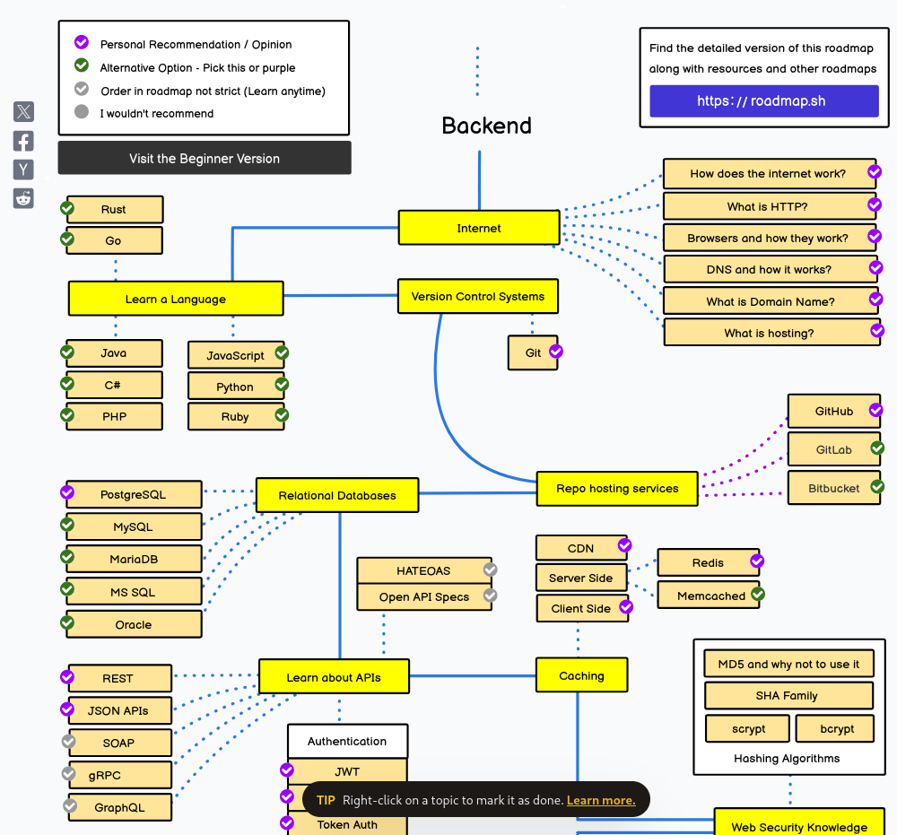

<!-- 
_class: lead
-->

# Aula 01 - Introdução à Web

---

<!--
paginate: true 
class: normal
-->

## Arquitetura da Web
### Início da Web

* Idealizado por Tim Berners Lee (na foto)
* CERN (Organização Europeia para Investigação Nuclear), na Suiça
* Facilitar a troca de documentos entre computadores
* Uso de projetos como o [MEMEX](https://web.stanford.edu/dept/SUL/library/extra4/sloan/MouseSite/Secondary.html)
* Não foi o único projeto com o mesmo objetivo

---

Tim Berners Lee e sua equipe foram responsáveis pela construção de 4 elementos:

1. Um servidor de documentos de hipertexto
1. Um cliente para acesso aos documentos (navegador)
1. Uma linguagem padronizada para estruturação de documentos (HTML)
1. Uma linguagem padronizada para a troca de documentos (HTTP)

---

> "As pessoas poderiam ter visto que havia dinheiro pra ser feito lá. Então teriamos muitas pequenas web ao invés de uma grande. E uma pequena web não funciona porque você não pode seguir um link de uma para outra."

Tim Berners Lee no documentário [Internet's Own Boy](https://www.youtube.com/watch?v=neMXxccVoAM&t=1485s)

Recomendação: [Tim Berners Lee e a Próxima Web](https://www.youtube.com/watch?v=Mhu3GN74CUg)

---

## initialize()

- Discuta com os colegas e identifique as principais características dos períodos de evolução da web;

- Identifique serviços/aplicações/paradigmas comuns de cada um dos períodos.

> Ex.: Web 1.0 (Década de 90):
> * Páginas estáticas
> * Acesso direto

---

## A Evolução da Web

---

### Web 1.0

* 1989 a 2005
* Centrada na busca de conteúdo
* Sem interatividade
* Paginas estáticas

---

---

### Web 2.0

* Termo cunhado por Dale Dougherty em 2004
* Centrada em comunidades e negócios
* Conteúdo produzido pelos usuários
* Interatividade

Recomendação: [CS50 Lecture by Mark Zuckerberg - 7 December 2005](https://www.youtube.com/embed/xFFs9UgOAlE)

---

---

### Web 3.0

* Termo sugerido por John Mark em 2006
* Web Semântica
* Padronização de dados e implementações
* Interoperabilidade entre aplicações
* Separação da web em camadas
* Uso massivo fora do espaço tradicional (navegadores)

---

---

### Web 4.0

* Computação Ubíqua
* Interação entre dispositivos
* Big data e Inteligência Artificial
* Internet das Coisas

---

### Web 5.0

* ???
* Interação Emocional (Affective Computing)
* Neurociência e Inteligência Artificial
* Sentimentos na troca de informação

---

> "Você está namorando seu computador?"
> "Ela não é apenas um computador"

Filme: [Her, 2013](https://www.adorocinema.com/filmes/filme-206799/)

---

## O que esperar do Desenvolvimento para Web na **prática**?

---

[Roadmap Completo](https://roadmap.sh/backend)

---

## finalize()

- Pesquise por pelo menos dois exemplos de APIs web públicas, capazes de fornecer dados de qualquer tipo para outras aplicações.

---

## Links Úteis

* (Internet Live Stats)[https://www.internetlivestats.com/]

---

## O que aprendemos nesta aula?

* De onde surgiu a web e como evoluiu na sua história
* Quais as projeções para a Web no futuro